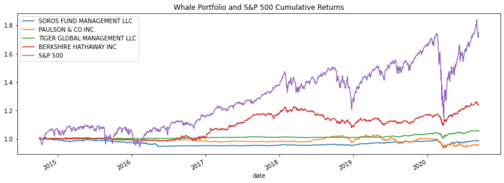

# Analyzing Portfolio Risk and Return

This Jupyter lab notebook analyzes the risk-return profiles of four managed fund investment "Whale" portfolios.  It specifically analyzes the performance, volatility, and risk of the investment options, using the S&P 500 Index as a benchmark.

---

## Technologies

This analysis is a Jupyter lab notebook that makes use of the following Python libraries:
* Pandas
* Pathlib
* Numpy
* Matplotlib

---

## Installation Guide

To use this notebook, install Jupyter lab Version 3.0.14 and Python 3.7

Open the notebook in Jupyter lab and you can run the analysis.

---

## Examples

Here is an example of the type of visualization this notebook provides.  Here are the cumulative returns of the four "Whale" portfolios plotted along with the cumulative returns of the S&P 500 Index, over the timeframe of the included dataset (whale_navs.csv) which spans from 10/1/2014 to 9/11/2020.

The notebook contains analyses of the generated metrics and data visualizations, and draws some conclusions about which whale portfolio is a good investment option.

---

## Contributors

Michael Danenberg

---

## License

MIT
